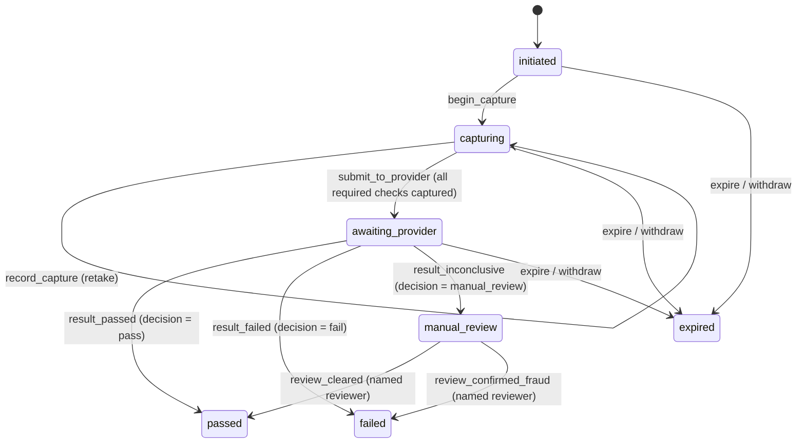

# Identity & Verification

> Issue [#3](https://github.com/katzimoto/been_there/issues/3). Parent:
> [#1](https://github.com/katzimoto/been_there/issues/1).
> Authority: [System domains & boundaries](./00-overview.md). If this document
> contradicts the overview's eight commitments, the overview wins and this
> document is wrong.
>
> Vocabulary used here — identity state, account state, risk state, `caseId`,
> `DataSensitivity` — is the overview's, not a local synonym set.
> Package: `packages/identity`. Entry point: `packages/identity/src/index.ts`.

The product's promise is that every user is verified. This document is the part
of the system that makes that promise true, and — just as importantly — the part
that makes it *cheap to keep true*: a verifier that is easy to fool produces fake
accounts in real people's dating lives, and a verifier that punishes real people
for a blurry photo produces a product nobody uses.

Two facts do the work:

1. `verified` is the only discoverable identity state, and that is a property of
   a transition table rather than of any check the dating product remembers to
   perform.
2. Nothing about *how* a person was verified ever leaves this domain. Other
   domains learn a state and a generation number. Everything else — evidence,
   provider answers, confidence, anomaly codes — stays here, classified and
   audited.

## 1. Boundary

| This domain owns | This domain never owns |
|------------------|---------------------|
| The verification attempt lifecycle (`initiated` → `capturing` → `awaiting_provider` → `passed \| failed \| manual_review \| expired`) | The identity state machine itself — it is the shared kernel's (`packages/core/src/states/identity.ts`), and this domain only ever drives it through its public events |
| Identity confidence: the bounded value, the bands, and the threshold policy | Risk scoring. A pattern about a person's accounts is a *risk* input; a pattern about their identity evidence is ours |
| Identity anomaly detection and the findings it produces | Account enforcement. A finding routes to `flag_for_review`; only moderation, on a case, may restrict, suspend, or ban |
| Evidence classification, retention deadlines, and audited access grants | The evidence *store*. The domain holds opaque references, never bytes |
| The provider boundary: a vendor-neutral port and the failure taxonomy around it | The provider. No vendor concept appears in any type in this domain |
| The re-verification command interface, its authority table, and its anti-abuse limits | Whoever may call it. Trust & Safety's rules are Trust & Safety's; this domain only decides whether the request is lawful and safe |
| The public projection other domains read, and the event catalogue | Discovery eligibility, matching, ranking, or any product surface |

The one-line version: **this domain answers "is this a sufficiently real person?"
and refuses to answer anything else.**

## 2. Two lifecycles, deliberately

The overview defines one identity machine. This domain adds a second, narrower
one for the attempt. They are not redundant, and collapsing them is how a
platform ends up telling someone "you failed verification" because a vendor was
down for ninety seconds.

| | Identity machine (kernel) | Attempt machine (this domain) |
|---|---|---|
| Question | Is this account a sufficiently real person? | What is happening to this verification right now? |
| States | `unverified` `pending` `verified` `review_required` `verification_failed` `expired` | `initiated` `capturing` `awaiting_provider` `passed` `failed` `manual_review` `expired` |
| Owned by | `packages/core/src/states/identity.ts`, shared | `packages/identity/src/verification-request.ts` |
| Read by | Other domains, via the projection | Nobody outside this domain. It is an implementation detail of *how* we answered |
| Consequence of a wrong value | A real person is invisible, or a fake one is not | A retake is refused, or a review is opened early |

An attempt never *is* an identity state. `completeFromProvider` returns both the
new attempt state and the identity move the policy implies, resolved through the
kernel's machine so the two can never disagree.

## 3. The lifecycle

### 3.1 Identity state (kernel, read-only here)

The table is the kernel's, and this domain does not restate or extend it. What
matters here is *which* of its events this domain can cause, and how:

| Event | From | To | Who causes it | Guard |
|-------|------|----|---------------|-------|
| `submit_verification` | `unverified`, `expired`, `verification_failed` | `pending` | A first verification, started here | — |
| `liveness_passed`, `likeness_passed` | `pending` | `pending` | Provider results arriving mid-attempt | — |
| `provider_result_received` | `pending` | `verified` | This domain, on a `pass` decision | `confidence ≥ 0.9` |
| `fail` | `pending` | `verification_failed` | This domain, on a `fail` decision | — |
| `flag_for_review` | `pending`, `verified`, `verification_failed` | `review_required` | This domain, on a `manual_review` decision, an actionable anomaly, or three consecutive failed attempts (§5.1) | — |
| `review_cleared` | `review_required` | `verified` | A named human reviewer | `reviewerId` present |
| `review_confirmed_fraud` | `review_required` | `verification_failed` | A named human reviewer | `reviewerId` present |
| `expire` | `verified` | `expired` | The freshness policy | — |
| `reverify_requested` | `verified`, `expired` | `pending` | This domain's command interface | — |
| `withdraw` | any | `unverified` | The user | — |

Three of those edges are automatic in the way people usually mean "automatic":
`provider_result_received`, which is guarded by the confidence floor, `fail`, and
`flag_for_review` out of `verification_failed` — which is a support threshold,
not a safety verdict (§5.1). Everything else that can remove a person from
discovery requires either a named human or a policy decision recorded in this
document.

`reverify_requested` has no edge out of `review_required`, and that omission is
the point. While a person is with a human, an automated demand must not be able
to move them to `pending` and take them back out of it; that is commitment 2 in
shape, and it belongs in the kernel because a policy check in this package can
be bypassed by a direct call. A flagged account leaves review only through
`review_cleared` or `review_confirmed_fraud`.

### 3.2 Attempt state (this domain)



```text
  initiated ──begin_capture──▶ capturing ──submit_to_provider──▶ awaiting_provider
                                  ▲                                   │
                                  │ record_capture (retake)            │
                                  └───────────────────────────────────┘
                                                                      │
              ┌───────────────────────────────────────────────────────┤
              ▼                     ▼                                ▼
           passed                manual_review                       failed
      (decision = pass)   (decision = manual_review)        (decision = fail)
              ▲                     │
              │ review_cleared      │ review_confirmed_fraud
              │ (named reviewer)    ▼
              └─────────────── failed

  initiated | capturing | awaiting_provider ──expire / withdraw──▶ expired
  manual_review is deliberately NOT expirable: an attempt is never timed out
  from under the reviewer who is looking at it.
```

The three result guards do not trust the caller. `result_passed` re-derives the
decision from the provider output and the anomaly findings, so a hand-rolled
`result_passed` event carrying a 0.4 confidence is rejected by the table rather
than by a code review.

`assertMachineIsTotal(attemptMachine, ['passed', 'failed', 'expired'])` runs in
the test suite: a terminal state with an outgoing edge, or a state with no way
out, fails the build.

## 4. From a provider result to a decision

`decideVerificationOutcome` in `packages/identity/src/likeness.ts` is the whole
policy, in precedence order. The order is the design:

| # | Condition | Outcome | Why this position |
|---|-----------|---------|-------------------|
| 1 | Confidence is NaN, infinite, or outside `[0, 1]` | `manual_review` | A broken adapter is our bug. Our bugs do not decide whether a real person is verified |
| 2 | A `blocking` anomaly is present | `manual_review` | A rejected document *and* an impossible-travel signal has two explanations, and only one of them is fraud |
| 3 | A required check is missing, `inconclusive`, or `not_performed` | `manual_review` | A check nobody ran is not a pass and not a fail |
| 4 | A required check `failed`, and confidence is below the verified floor | `fail` | The provider and the policy agree it is a bad result |
| 5 | A required check `failed`, and confidence is at or above the verified floor | `manual_review` | Contradictory evidence. Never auto-decided, never auto-failed |
| 6 | Confidence below the automatic failure floor | `fail` | Providers reserve very low scores for "this is not a match at all" |
| 7 | Confidence in the human-review band | `manual_review` | The band exists so borderline results get a person |
| 8 | A `review`-level anomaly is present | `manual_review` | The account may be genuine while the account *pattern* is not |
| 9 | Otherwise | `pass` | Every required check passed, confidence sufficient, no actionable finding |

`informational` findings never appear in this table: they are recorded and stop
there.

Every outcome carries a `rationale` — a short ordered list the moderator tool
renders and the user can be shown after a review. It is built from the domain's
own values. A provider's wording may reach a moderator, but it never decides
anything and never reaches a user.

## 5. Confidence threshold policy

`CONFIDENCE_THRESHOLDS` in `packages/identity/src/likeness.ts`:

| Threshold | Value | Meaning |
|-----------|-------|---------|
| `verifiedFloor` | `0.9` | At or above this, a provider result may grant `verified` — provided every required check passed and no actionable anomaly fired |
| `autoFailFloor` | `0.55` | Below this the attempt fails automatically |

**Why 0.9 is not a tunable.** It is the same value the shared kernel's
`provider_result_received` guard checks, and a test asserts the two agree from
both sides. The asymmetry sets the number: a false accept puts a fake account
into a real person's dating life, which is the worst failure this product has;
a false reject costs one human review. When the two costs are not comparable,
pick the recoverable one. Any change to 0.9 is a change to
`packages/core/src/states/identity.ts` too, and it should be argued in review, not
landed as a config tweak.

**Why the band between 0.55 and 0.9 exists at all.** A single threshold produces
a cliff: a user at 0.899 is treated exactly like a user at 0.3. The band makes
the ambiguous middle a queue with a human in it, which is also where every
anomaly finding lands. The result is that `manual_review` is a normal, expected
outcome of the system rather than a failure of it.

**Bounds are enforced, not assumed.** `makeConfidence` rejects NaN, infinities,
negatives, and values above 1 before anything reads them, and a provider that
returns 1.4 produces a review rather than a pass.

### 5.1 Repeated failure escalates to a person

`REVIEW_ESCALATION_POLICY.consecutiveFailuresBeforeReview` is **3**, and
`escalateAfterRepeatedFailure(identityState, attempts)` in
`packages/identity/src/verification-request.ts` is what enforces it. The counter
is a *consecutive run* of `failed` attempts, read backwards from the attempt
that has just been recorded and stopping at the first attempt that is not a
failure; the caller supplies the attempts, because the count is a fact about the
store and not something the kernel can be told.

Three is a support threshold, not a safety verdict. One failure is a retake, two
is a bad lighting habit, and by the third the person has spent a meaningful
amount of their time in a capture loop with no outcome — which is a support
burden, and the only honest answer to "we cannot establish that this person is
real" is a person. It escalates to `review_required` and to nothing else: no
account state is written, no capability is removed, and the escape already
exists in both directions (`review_cleared` → `verified`,
`review_confirmed_fraud` → `verification_failed`), each needing a named reviewer.

`null` is the "not yet" answer — one more retry, not an error — so it is a
`Result` *value* rather than a rejection. A second ordinary failure should not
look like something went wrong.

This is not the same counter as §6's `repeated_failed_attempts` detector, and
the two are allowed to disagree. The detector counts failures *in a 30-day
window* across the subject's history and produces a `review` finding; the
escalation counts a *run* and moves the state. Someone who failed twice, then
verified, then failed once is an anomaly worth a human's eye and is not a
person being stuck in a loop.

The kernel's `flag_for_review` edge out of `verification_failed` is what makes
this buildable at all. Without it, `verification_failed` had exactly one
outgoing event — `submit_verification` back to `pending` — so "repeated failure
leads to `review_required`" resolved to `invalid_transition` and looping was the
only behaviour the table permitted.

## 6. Anomaly catalogue

Detectors consume aggregate signals only (`AnomalySignals`): counts, coarse
distances, and coarse age estimates. There is no field in that type that could
carry an artefact, and a finding carries numbers only. A finding is evidence for
a human, not a verdict.

| Code | Signal | Threshold | Severity | Why not higher |
|------|--------|-----------|----------|----------------|
| `repeated_failed_attempts` | Failed attempts in a window | 3 in 30 days | `review` | A bad photo week is common; three failures is a pattern |
| `implausible_age` | Declared age vs. evidence-derived age | ≥ 6 years | `review` | Face-based age estimation is biased. A wide gap is a question |
| `device_shared_across_accounts` | Distinct accounts on one device | 3 | `review` | A family phone or a repair-shop kiosk is a real explanation |
| `impossible_travel_between_attempts` | Distance between consecutive attempts | ≥ 500 km in < 2 h | `blocking` | One of the few patterns that indicates a *human* operator, not a script. It still only sends the case to a human — it never fails anyone by itself |
| `selfie_reuse_signal` | Near-duplicate capture across subjects | 1 | `review` | A partner or sibling helping someone through onboarding looks identical to fraud from here |
| `document_reuse_signal` | Near-duplicate document image across subjects | 1 | `review` | Same |
| `high_velocity_signups_from_network` | New accounts from one network signature | 8 in 24 h | `informational` | A campus or a corporate NAT is not a crime scene. Recorded for the fraud team, acted on nowhere |
| `identity_attributes_changed` | Identity attribute churn | 3 in 30 days | `informational` | Curiosity is common; a loop is worth recording |

**Severity means something specific:**

- `informational` — recorded. It cannot change any outcome.
- `review` — forces a human to look. It cannot fail a verification.
- `blocking` — forces a human to look *even when the checks themselves failed*.
  There is no severity that can fail a person, because failing a person is
  indistinguishable from punishing them for a bad photograph.

**The routing guarantee.** `detectIdentityAnomalies` returns findings.
`proposeReview` returns a `ReviewProposal` whose `identityEvent` is the single
literal `'flag_for_review'`. There is no code path from a detector to an account
state, because the type that leaves this module has no field that could name
one. A test asserts the plan's exact key set and that its serialised form
contains no enforcement vocabulary.

## 7. The provider boundary

`VerificationProvider` in `packages/identity/src/provider.ts` is a port, not a
client. Three operations, all vendor-neutral:

```ts
interface VerificationProvider {
	readonly label: string;                                    // "primary", "fallback"
	startSession(request: ProviderSessionRequest): Promise<Result<ProviderSession, DomainError>>;
	fetchResult(session: ProviderSession): Promise<Result<ProviderVerificationResult | null, DomainError>>;
	releaseSession(session: ProviderSession): Promise<Result<void, DomainError>>;
}
```

The vocabulary the domain reasons about is a list of *checks*
(`document_authenticity`, `liveness`, `likeness`, `document_to_selfie_match`,
`age_consistency`), never a vendor's product names. `ProviderVerificationResult`
carries scores, not a verdict: the threshold policy is ours, so a vendor changing
its default cannot change who we verify. `fetchResult` returning `null` means
"not finished yet", which is the ordinary waiting case, not an error.

### Failure modes

| Reason | Retryable | `classifyProviderFailure` returns | What the user is told |
|--------|-----------|-----------------------------------|----------------------|
| `unavailable` | yes | `retry_later` | Nothing; the attempt keeps waiting |
| `rate_limited` | yes | `retry_later` | Nothing; the attempt keeps waiting |
| `malformed_response` | no | `attempt_needs_review` | We could not read the result. A human will look |
| `rejected_capture` | no | `attempt_failed` | The capture was not readable; retake it |
| `unsupported_document` | no | `attempt_failed` | That document type is not supported here |

The effect is computed in the domain, not chosen by the adapter: an adapter
reports *what happened* and `classifyProviderFailure` decides what it means for
the attempt, so a vendor outage cannot be recorded as a user failure. The two
rows that matter most are the first and the third.

- **A vendor outage is never a user failure.** `classifyProviderFailure` maps
  `unavailable` and `rate_limited` to `retry_later` and nothing else can override
  it, so "the vendor was down" can never be presented as "you failed".
- **An unparseable answer is our problem.** `malformed_response` maps to
  `attempt_needs_review`: a response we cannot understand is evidence about the
  adapter, not about the person in front of the camera, and it must not end an
  attempt as a failure.

`providerFailureError` is the single normalisation point: adapters call it rather
than letting vendor error text escape into a `Result` or a log line.

## 8. Re-verification

`requestReVerification(command, context, sinks)` in
`packages/identity/src/reverification.ts` is a command interface. Other domains
may *ask*; only this domain decides. It returns a `Result`, and a success is a
plan, not a mutation: the caller resolves the identity state through the kernel's
machine and then persists it.

`sinks` is a `ReverificationSinks` — a `refusals` log and a `signals` log — as
one argument rather than two. A separate parameter would have let a caller pass
the refusal log and leave escalation unwired, which is the exact shape of the
failure §"Anti-abuse limits" below records.

### Who may ask

| Requester | May demand | Never |
|-----------|------------|-------|
| `trust_safety` | `risk_signal`, `anomaly_findings` | Anything on behalf of a user |
| `moderation` | `case_linked`, `anomaly_findings` | A re-verification with no case behind it |
| `subject` (the user) | `user_requested`, `identity_expired`, and only while `expired` | A re-verification of an account that is already `verified`, or of their own `verification_failed` attempt — that one is *retried* through `submit_verification`, which the machine allows from `verification_failed` and which lands in the same `pending` |
| `dating_core` | **Nothing. Ever.** | Every reason, without exception |

The dating core is refused because a product domain that could demand identity
checks could turn "she did not reply to me" into a forced identity
interrogation. That is a harassment primitive wearing a safety costume, and it is
refused in code rather than in a review comment.

### Anti-abuse limits

A re-verification is disruptive: it interrupts the user and drops them out of
discovery while it runs. The limits exist to protect the user from being
repeatedly hidden, not to protect the vendor's budget.

| Limit | Value | Reason |
|-------|-------|--------|
| `maxPerSubjectPer30Days` | 3 | Enough for a real pattern (expired, then a risk signal, then a case); low enough that no caller can keep someone permanently invisible |
| `cooldownHours` | 24 | The minimum gap between two re-verifications |
| Open attempt | any state that is not `passed`, `failed`, or `expired` | A `conflict`, so demands cannot stack |
| Open human review | `review_required` | A `conflict`. The machine has no `reverify_requested` edge out of it either, so an automated caller cannot walk an escalated case back into `pending` |

The two numbers are **decided**, not provisional. They are exported, asserted in
`test/reverification.test.ts`, and changed by editing the constant; what is
revisit-able is the rate, not the mechanism.

**Past a limit, an automated caller raises a signal.** `requestReVerification`
writes a `ReverificationLimitSignal` to `sinks.signals` before returning
`rate_limited`, carrying the limit tripped (`per_subject_per_30_days` or
`cooldown`), the count in the window, and `blockedUntil` — when the block lifts,
so the caller resumes rather than gives up. Without it, the only artefact of
"Trust & Safety pulled this person out of discovery for the fourth time this
month" is an error code in the caller's own log, and the moderation queue never
learns the pattern exists.

Two deliberate exclusions. A `subject` demand that trips a limit raises
**no** signal: a person tapping "verify again" twice has found a rate limit, and
the refusal row is the whole record; escalating a user's own impatience would
fill a human queue with nothing. And Identity does not open a case itself — it
has no case vocabulary and the dependency runs the other way — so the record is
handed to the caller, and Trust & Safety's is to turn into a case.

### Check order

1. **Reason and requester kind** — is this requester entitled to ask at all?
2. **Cross-subject authority** — if the requester kind is `subject`, the actor
   must be the subject. A user demanding another user's re-verification is
   refused here, before any check that could describe the target.
3. Subject eligibility (`REVERIFICATION_POLICY.subjectMayRequestOnlyWhen`).
4. An open human review — refused for **every** requester kind, before the
   in-flight check, so it cannot be used as a probe.
5. In-flight attempts.
6. The 30-day cap.
7. The cooldown.
8. The kernel's state machine.

The order is a privacy property: an unauthorised caller is refused before any of
the later checks run, so it cannot learn whether a subject has an attempt in
flight, how many re-verifications they have had, or what state they are in. The
cross-subject refusal in particular returns a byte-identical error whatever the
target's state, so it is not a probe for that state. Tests assert both.

**Every refusal is recorded** in `sinks.refusals` before the error is
returned, carrying the actor, the intended subject, the requester kind, the
reason and the error code. `detectReverificationAbuse` groups cross-subject
demands per actor and raises a `cross_subject_reverification_demand` anomaly
finding against the **offender**, routed through the existing
`proposeReview` → `flag_for_review` path. The offender is reviewable by a human;
nothing here changes an account state.

Step 3 is a **subset** of the machine's `reverify_requested.from`, and it has to
stay one: the policy gate runs before the in-flight, cap and cooldown checks, so
a state it admits and the machine rejects is a call that pays for all three and
then returns `invalid_transition`. A subset fails closed — the machine has the
last word on states the policy does not name.

A plan contains an identity move and nothing else. It cannot carry an account
state, because the type has no field for one.

## 9. The public projection

`IdentityStatusProjection` in `packages/identity/src/read-model.ts` is the entire
cross-domain read surface of this domain.

```ts
interface IdentityStatusProjection {
	readonly projectionVersion: 1;
	readonly subjectId: SubjectId;
	readonly state: IdentityState;
	readonly generation: number;    // increments on every state change
	readonly discoverable: boolean; // derived from isDiscoverableIdentity
	readonly updatedAt: Date;
}
```

That is the whole type. What is deliberately missing, and why:

| Missing | Why |
|---------|-----|
| confidence, band, thresholds | A consumer could re-rank people by how "verifiable" they look. That is a discrimination surface, and a subtle one |
| evidence references, digests, storage refs | They leak both the vendor and the person |
| provider label, provider reason text | A vendor is an internal decision, not a product fact |
| anomaly codes and severities | A dating client that knows an account tripped a reuse signal is a dating client that can act on it. The safety spine promises it cannot |
| `latestVerificationId` | Named in the overview's forbidden table. A consumer that can join to the attempt table has left the boundary, whatever the type says |
| reviewer id, review timestamps | A dating client must not be able to infer that a user was reviewed |

**The separation is enforced at the type level, not by convention.** The test
suite declares `NotAKey<IdentityStatusProjection, 'evidence'>` and its siblings;
adding any of those fields to the projection is a compile error in
`read-model.test.ts`, not a review catch.

**`discoverable` has one definition.** It is derived at construction from the
kernel's `isDiscoverableIdentity`, and `toIdentityRecord` rebuilds a kernel
record from the projection so a consumer can call the same predicate. That
rebuilt record carries `latestVerificationId: null` on purpose:
`isDiscoverableIdentity` does not read it, and carrying the real value would be
the exact leak the overview forbids.

`generation` is the staleness contract. A projection rebuilt with a new timestamp
but the same generation carries the same status, and
`hasProjectionChanged` reports no change.

## 10. Event catalogue

One table, in `packages/identity/src/events.ts`. Sensitivity comes from the
catalogue row and is never a caller argument, so an event cannot be published at
a lower classification than its type allows.

| Event | Sensitivity | Payload | Consumed by |
|-------|-------------|---------|-------------|
| `identity.status_changed` | `public` | `{ identity: IdentityStatusProjection }` — the projection and nothing else | Dating Core, Discovery, everyone |
| `verification.attempt.started` | `internal` | attempt id, re-verification flag, reason code | Platform ops, analytics |
| `verification.attempt.completed` | `internal` | attempt id, attempt state, decision label, **band** (not the score) | Platform ops, Trust & Safety |
| `verification.review.proposed` | `sensitive` | subject, detector, findings | Trust & Safety, Moderation |
| `verification.anomaly` | `sensitive` | subject, findings (codes and counts) | Trust & Safety |
| `verification.re_verification.requested` | `internal` | subject, reason code, requesting domain | Trust & Safety, Moderation, audit |
| `verification.evidence.accessed` | `restricted` | the audit entry, granted or denied | Audit, Moderation |

The distribution is the design:

- **Exactly one `public` event**, and its payload is the public projection. A
  product client can be driven by the bus alone, which means the leak surface for
  the dating product is one event with six fields.
- **Findings are `sensitive`.** Trust & Safety may subscribe; the product may
  not. A test subscribes three consumers at three clearances and asserts the
  product consumer receives only `identity.status_changed`.
- **Evidence access is `restricted`**, because the access log is the record that
  has to outlive the artefact it describes.

## 11. Evidence

`VerificationEvidence` in `packages/identity/src/evidence.ts`:

```ts
interface VerificationEvidence {
	readonly kind: 'government_id_image' | 'selfie_image' | 'liveness_video'
		| 'document_text_extract' | 'provider_response';
	readonly verificationId: VerificationId;
	readonly capturedAt: Date;
	readonly storageRef: string;          // opaque, non-guessable, not a URL
	readonly sensitivity: 'restricted';    // pinned to the literal
	readonly digest: string;               // SHA-256, non-reversible
	readonly expiresAt: Date;              // computed once, from the policy
}
```

Three structural decisions:

1. **The type has no field that can carry an image, a video, or a presigned
   URL.** Evidence cannot leave this domain through a return value, an event
   payload, or an accidental log of a struct. `storageRef` is an opaque locator,
   not a resolvable link.
2. **Classification is pinned.** `sensitivity` is typed as the literal
   `'restricted'`, so every artefact in this domain's evidence set — biometrics,
   derived text, and provider responses alike — carries the strictest class the
   system has. The overview's table names "selfie/liveness artefacts" and
   "provider responses" as `sensitive`; this domain stores all of them one class
   stricter, because commitment 7 classifies per *field* and a stored artefact is
   the one field class in the system that cannot be reissued. The looser
   `sensitive` class is still used where the overview intends it: the anomaly and
   review *events* this domain publishes are `sensitive`, because they describe a
   person rather than store their body.
3. **A retake supersedes.** Re-capturing the same kind replaces the earlier
   artefact. A user who re-uploads their passport six times must not leave six
   copies of their passport behind.

### Retention

`EVIDENCE_RETENTION` is a named policy, not a job's magic numbers:

| Class | Retention | Reason |
|-------|-----------|--------|
| Biometric artefacts | 30 days after capture | Long enough to cover the appeal window a real user needs; short enough that a breach of the evidence store is not a breach of everyone's face |
| Derived extracts (OCR text, provider verdicts) | 180 days | Supports appeals and provider disputes, and is re-derivable from a document the user can re-upload |
| Access logs | 2555 days (7 years) | An audit trail deleted with the artefact cannot answer "who looked at this?", which is the only question it exists for |
| Legal hold | Suspends deletion | Recorded, never silent |

These numbers are placeholders pending the per-market legal answer in Open
questions. They are one constant so that the answer is one edit.

### Audited access

`grantEvidenceAccess(request, evidence, log)` grants or explains, and writes
exactly one audit record either way.

| Condition | Result |
|-----------|--------|
| `actorKind` is `system` | `permission_denied` — automation never reads evidence. A detector, a job, and a service are all `system` |
| Role is not `moderator`, `identity_reviewer`, or `identity_ops` | `permission_denied` |
| Justification shorter than 24 characters | `validation_failed` — "I am an operator" is not a justification |
| No artefact still inside retention | `not_found` |
| Otherwise | A grant: the unexpired refs, one use, 15 minutes |

The denial order is deliberate. The actor is checked before the justification and
before whether any evidence exists, so an unauthorised caller learns nothing
about what is on file. A denial is recorded as loudly as a grant, because the
denial is what a reviewer will ask to see after an incident.

## 12. Security and privacy

**Biometric data.** A selfie is not a password. If a face template leaks, the
person cannot rotate it. Consequences, all structural rather than procedural:

- Raw artefacts are `restricted` and every read is an audited, single-use,
  15-minute grant.
- No automated actor — detector, job, service — can read evidence at all.
- The domain holds references, not bytes, so evidence cannot be serialised into a
  log line, an event, or a support ticket by accident.
- A retake supersedes rather than accumulates.
- Erasure propagates: `releaseSession` exists so a deletion request can reach the
  processor that holds vendor-side copies. The domain's retention deadline is the
  real one; the vendor call is best effort and must not be the enforcement point.

**Never logged, never emitted, never rendered:**

- raw artefacts, digests, or storage references outside the evidence store
- provider names, vendor session ids, or vendor reason strings on any product
  surface
- confidence scores, bands, or thresholds on any product surface
- anomaly codes or severities on any product surface
- a moderator or reviewer identity on any product surface
- a justification string, which contains a person's reason for looking at another
  person's document

**What a user is told.** The resulting identity state, the next action, and — after
a review — the decision rationale, which is generated by this domain from its own
values. Never a vendor's wording, never a detector name, never another person's
data.

**Log hygiene.** Field-level classification is enforced at the sink, not at each
call site (ADR 0005). The types here are arranged so that the sink has nothing
dangerous to filter: the values that must never be logged are not reachable from
a return type that a logger would receive.

## 13. Open questions

Recorded rather than guessed, because a wrong number here is a legal or a
fairness problem, not a bug.

1. **Vendor selection, and build versus buy.** No provider is chosen. The port is
   vendor-neutral by design, but the port's shape was written against one class
   of vendor (document + selfie + liveness + likeness) and has not been tested
   against a second. Depends on the pricing and latency research in
   `docs/research/`.
2. **Retention period per market.** The 30 / 180 / 2555 day numbers are a
   documented placeholder. Biometric retention is a regulatory question in the
   EU (GDPR erasure and storage limitation), in US states with biometric
   statutes, and in Brazil's LGPD. Needs a legal answer per market, not a
   technical one.
3. **Bias and fairness in face-based age estimation.** `implausible_age` uses a
   provider estimate that is measurably worse for some populations. Today the
   worst it can do is send someone to a human, which is a mitigation and not a
   fix. Open: whether to keep the detector at all, whether to publish per-group
   accuracy, and what a user is told when age estimation contributed to a review.
4. **The 0.9 floor.** Set by an argument about asymmetric costs, not by
   measurement. We have no data yet on the false-accept rate at 0.9, and the
   floor should be revisited once there is. Until then it is deliberately not
   configurable.
5. **Verification expiry.** The kernel has `expire`, and the attempt has a 24-hour
   TTL, but how long a *verification* stays valid is not decided here. A periodic
   re-verification sweep is a product decision with a real user cost, and it is
   not yet made.
6. **Manual review staffing.** The policy deliberately sends borderline and
   anomalous results to humans. That is a queue with a service level attached, and
   the service level belongs to moderation, not to this domain. If reviews are
   understaffed, the band in §5 is too wide, and the honest fix is more reviewers
   rather than a lower threshold.
7. **Reuse detection across subjects.** The detectors take counts from somewhere.
   Whether that is a perceptual hash store, a vendor-side check, or a
   platform-wide index is an architecture decision with a privacy cost of its own,
   and it is not made.
8. **The attempt cap and its copy.** `ATTEMPT_POLICY` allows five attempts in a
   rolling day with a 15-minute retake cooldown, and both refusals carry a
   `retryAt` so a screen can say *when* rather than saying "Try again" and then
   refusing. What is still undecided is the wording for a person who has used
   all five: that is a copy decision, not a constant, and the numbers are not
   what is in question.
